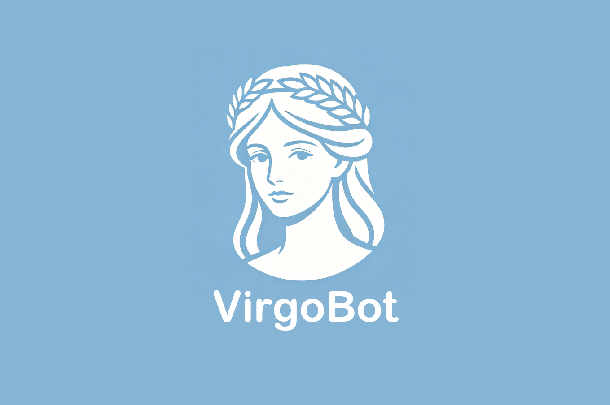

<div align="center">
  
  <h1>VirgoBot</h1>
  <p><strong>有灵魂、会成长、全天候在线的专属 AI 智能体</strong></p>
  <p>基于 .NET 10 打造的本地化私有化多通道个人 AI 助手框架</p>

  
  
  
  
  
</div>

---

## 目录

- [项目定位](#项目定位)
- [核心亮点](#核心亮点)
- [Web 管理面板](#web-管理面板)
- [快速开始](#快速开始)
- [WebSocket 接入指南](#websocket-接入指南)
- [技术栈](#技术栈)
- [配置示例](#配置示例)
- [架构说明](#架构说明)
- [注意事项](#注意事项)
- [最近更新](#最近更新)

---

## 项目定位

VirgoBot 是一个聚焦**高端私人情感陪伴 + 智能效率助理**双核心场景的个人 AI 助手。它打破通用大模型「千人一面」的同质化困境，为每位用户打造**独一份、有灵魂、会成长**的专属智能体。

全设备无界接入、零代码能力扩展、私有化安全部署——重新定义个人 AI 助手的体验标准。

---

## 核心亮点

### 🧠 Soul 记忆——专属灵魂内核

这是 VirgoBot 区别于所有通用 AI 的核心壁垒。

Soul 记忆不是传统的长期记忆，而是**用户与智能体深度绑定的灵魂内核**。它镌刻用户的性格偏好、情感习惯、专属交互逻辑、私密情感联结，是智能体的身份本源。LLM 在对话中自主读取和写入 Soul，带 5 分钟内存缓存，SQLite 持久化存储。

你的智能体不再是对所有人都一样的工具，而是**只属于你、无可复制的专属陪伴者**。

Web 面板提供可视化的 Soul 管理界面，支持手动增删改查每一条灵魂记忆。

### 🔄 自进化引擎——定时任务 + 自然语言 Skill

智能体具备活态自进化能力，无需人工干预即可持续迭代：

- **定时任务系统**：支持 HTTP 请求、Shell 命令、文本指令三种任务类型，间隔/每日/一次性执行。口语化一键创建——「每天 20 点自动获取国际财经新闻，整合生成 HTML 文件保存至桌面」，让智能体越用越强大
- **零代码 Skill 生成**：纯自然语言描述需求，AI 自动生成完整技能配置（JSON / SKILL.md 格式），实时生效无需重启，支持单功能和多子功能 Skill，兼容 OpenClaw 格式导入

### 💬 极致拟人化交互

搭配深度定制的拟人化提示词、时间感知（消息自动附加北京时间戳）、空闲主动发起对话、消息智能分片等能力，结合 Soul 记忆的灵魂内核，智能体拥有真人级的情感反馈逻辑，提供沉浸式、有温度的专属情感陪伴。

- **自动响应模式**：用户空闲后 LLM 自主发起对话，可配置时间区间
- **消息分片**：长消息按自定义分隔符智能分段，模拟真人聊天节奏
- **AI 生成角色设定**：输入角色名称，AI 自动生成 2000+ 字的详细人物设定
- **自然语言生成Skill**：在聊天中可直接使用自然语言生成Skill，不需要写代码也能创建自己的专属Skill

### 🌐 全设备无界接入

原生支持 WebSocket 实时双向通信，任意设备、任意地域接入本地部署的 AI 助手：

| 通道 | 说明 |
|------|------|
| **WebSocket** | 实时双向通信，支持多客户端并发连接 |
| **HTTP API** | RESTful `/chat` 端点，标准化接口 |
| **Telegram Bot** | 内联按钮、Markdown、表情包发送 |
| **OpenILink.SDK** | 桥接微信、钉钉等第三方平台，支持图片/语音/视频/文件发送、自动重连和消息分片 |
| **Email** | IMAP/SMTP 邮件监控，AI 自动摘要，多通道通知推送 |

### 🎙️ 沉浸式语音交互

深度集成**火山 ASR 语音识别 + TTS 语音合成引擎**，支持自定义音色，实现「语音对话 + 语音回复」全闭环，将文字交互升级为沉浸式语音陪伴。

### 🔌 MCP 协议集成——无限扩展工具生态

原生支持 [Model Context Protocol](https://modelcontextprotocol.io/)，一键接入海量第三方工具：

- **双传输模式**：stdio（本地进程）和 Streamable HTTP（远程服务），覆盖所有 MCP 服务器
- **透明注入**：MCP 工具自动注册为 `mcp_{服务器名}_{工具名}`，LLM 无感调用，与内置工具完全一致
- **热管理**：Web 面板在线添加/编辑/删除/重连 MCP 服务器，无需重启
- **全平台兼容**：Windows（自动 cmd.exe 包装）、Linux、macOS 均可运行
- **后台并行连接**：MCP 服务器异步连接，不阻塞主服务启动

### 🛠️ 全能力工具生态

内置丰富的工具，情感陪伴与效率两不误：

- **Shell 命令执行**：交互式会话 + 后台任务
- **文件操作**：读写文件、目录管理
- **邮件收发**：IMAP/SMTP，AI 自动摘要和回复
- **联系人管理**：SQLite 存储，增删改查
- **表情包管理**：本地表情包库搜索和发送
- **自定义技能**：JSON / SKILL.md 格式，支持命令式和 HTTP 式

所有工具通过 `FunctionRegistry` 统一注册，以 OpenAI tools 格式注入 LLM 请求，支持 Agentic 递归工具调用链。工具按类别（builtin / skill / mcp）分类管理，支持去重保护和按类别卸载。

### 🔒 私有化安全底座

- 全程本地部署，数据本地持久化，无云端上传
- 所有情感记忆、灵魂内核、私人信息 100% 可控
- JWT 认证 + AccessKey 双重鉴权，API 与 WebSocket 全链路保护
- 首次启动交互式设置管理员账户，密码 SHA256 哈希存储
- Web 面板支持修改密码、AccessKey 管理（创建/删除/启停）

---

## Web 管理面板

基于 React 19 + TypeScript + HeroUI 3 + Tailwind CSS 4 的现代化管理界面，支持中英双语：

| 页面 | 功能 |
|------|------|
| **仪表盘** | 运行状态、在线时长、通道健康度、Token 统计 |
| **聊天** | 三栏布局：会话列表 + 对话面板（含 Soul 记忆）+ Agent 面板，支持消息删除、分片显示、语音回复 |
| **技能管理** | 动态增删改查，自然语言生成，OpenClaw 格式导入，保存后自动重启生效 |
| **定时任务** | 创建和管理定时任务，支持间隔/每日/一次性执行 |
| **联系人** | 可视化管理，支持搜索 |
| **Agent 管理** | 多 Agent 配置，AI 一键生成完整人物设定 |
| **MCP 服务器** | 管理 MCP 服务器连接，查看工具列表，支持 stdio / Streamable HTTP 传输 |
| **安全管理** | AccessKey 管理（创建/删除/启停/复制）、修改密码 |
| **供应商管理** | 多 LLM 供应商配置（OpenAI / Anthropic / Gemini 等），一键切换 |
| **频道配置** | 在线配置 Telegram、Email、iLink 通道 |
| **设置** | 编辑系统提示词、规则文件，按级别筛选/搜索/分页浏览运行日志 |

---

## 快速开始

- 直接在[Github Releases](https://github.com/Yuxi-IT/VirgoBot/releases)页面下载预编译的二进制文件.
- 解压后直接打开可执行文件(Windows、Linux).
- 使用浏览器打开[localhost:8765](http://localhost:8765)访问管理面板.
- 在`供应商`页面填写你的ApiKey和供应商BaseUrl信息即可.

### 手动部署

**后端**
```bash
dotnet restore && dotnet build
dotnet run --project VirgoBot/VirgoBot.csproj
```

首次启动自动生成 `config/config.json`，并通过终端交互设置管理员用户名和密码。

**前端**
```bash
cd webapp
npm install
npm run dev        # 开发模式
npm run build      # 生产构建
```

---

## WebSocket 接入指南

VirgoBot 通过 WebSocket 提供实时双向通信，你可以将其接入任何客户端应用（桌面、移动端、IoT 设备等）。

### 1. 获取 AccessKey

WebSocket 连接需要 AccessKey 认证。登录 Web 管理面板后，进入 **安全管理** 页面创建一个 AccessKey 并复制密钥。

### 2. 建立连接

WebSocket 地址格式：

```
ws://<host>:8765/?key=<your_access_key>
```

不携带 `key` 参数或 key 无效/已停用时，服务端返回 `401 Unauthorized` 并关闭连接。

### 3. 消息协议

所有消息均为 JSON 文本帧。

**发送消息（客户端 → 服务端）**

```json
{
  "type": "message",
  "message": "你好，今天天气怎么样？"
}
```

**接收回复（服务端 → 客户端）**

```json
{
  "type": "sendMessage",
  "content": "今天北京晴，气温 25°C，适合出门~"
}
```

> AI 可能会在处理过程中调用工具（搜索、文件操作等），工具调用完成后才会返回最终回复，因此响应时间取决于任务复杂度。

### 4. 完整示例

**JavaScript / Node.js**

```javascript
const ws = new WebSocket('ws://localhost:8765/?key=YOUR_ACCESS_KEY');

ws.onopen = () => {
  console.log('已连接');
  ws.send(JSON.stringify({ type: 'message', message: '你好' }));
};

ws.onmessage = (event) => {
  const data = JSON.parse(event.data);
  if (data.type === 'sendMessage') {
    console.log('AI:', data.content);
  }
};

ws.onclose = () => console.log('连接关闭');
```

**Python**

```python
import asyncio, json, websockets

async def chat():
    uri = "ws://localhost:8765/?key=YOUR_ACCESS_KEY"
    async with websockets.connect(uri) as ws:
        await ws.send(json.dumps({"type": "message", "message": "你好"}))
        response = json.loads(await ws.recv())
        if response["type"] == "sendMessage":
            print("AI:", response["content"])

asyncio.run(chat())
```

### 5. 广播机制

VirgoBot 支持多客户端同时连接。当 AI 通过其他通道（Telegram、Email 等）产生回复时，所有已连接的 WebSocket 客户端都会收到广播消息，可用于实现多端消息同步。

---

## 技术栈

**后端**
- .NET 10、SQLite（Microsoft.Data.Sqlite）
- System.IdentityModel.Tokens.Jwt（JWT 认证）
- Telegram.Bot、MailKit、OpenILink.SDK
- HtmlAgilityPack、Spectre.Console

**前端**
- React 19 + TypeScript 5 + Vite 5
- HeroUI 3 + Tailwind CSS 4 + Framer Motion
- Gravity UI Icons、i18n（中/英）

---

## 配置示例

```json
{
  "providers": [
    {
      "name": "OpenAI",
      "apiKey": "YOUR_API_KEY",
      "baseUrl": "https://api.openai.com/v1",
      "currentModel": "gpt-4",
      "models": ["gpt-4", "gpt-4o"],
      "protocol": "OpenAI"
    }
  ],
  "currentProvider": "OpenAI",
  "server": {
    "listenUrl": "http://0.0.0.0:5000/",
    "maxTokens": 8192,
    "messageLimit": 20,
    "messageSplitDelimiters": "。|！|？|?|\n\n|\n",
    "autoResponse": {
      "enabled": false,
      "minIdleMinutes": 30,
      "maxIdleMinutes": 120
    }
  },
  "channel": {
    "telegram": {
      "enabled": false,
      "botToken": "YOUR_BOT_TOKEN",
      "allowedUsers": [123456789]
    },
    "email": {
      "enabled": false,
      "imapHost": "imap.example.com",
      "imapPort": 993,
      "smtpHost": "smtp.example.com",
      "smtpPort": 587,
      "address": "your@email.com",
      "password": "your_password",
      "notification": {
        "notifyToTelegram": false,
        "notifyToILink": false,
        "notifyToWebSocket": false
      }
    },
    "iLink": {
      "enabled": false,
      "token": "YOUR_TOKEN"
    }
  }
}
```

### MCP 配置示例（config/mcp.json）

```json
[
  {
    "name": "aMap",
    "transport": "stdio",
    "command": "npx",
    "args": ["-y", "@amap/amap-maps-mcp-server"],
    "env": { "AMAP_MAPS_API_KEY": "YOUR_KEY" },
    "url": "",
    "enabled": true,
    "timeoutSeconds": 30
  },
  {
    "name": "weather",
    "transport": "sse",
    "command": "",
    "args": [],
    "env": {},
    "url": "http://localhost:3000/mcp",
    "enabled": true,
    "timeoutSeconds": 30
  }
]
```

---

## 架构说明

### 消息流转

所有通道的消息经白名单校验后汇入统一处理链路：

```
用户消息 → 白名单校验 → MemoryService 存储 → 构建上下文（系统提示词 + Soul + 近 N 条消息）→ LLM API → 响应/工具调用
```

### Agentic 工具调用

LLM 返回的 `tool_calls` 触发递归循环：解析工具 → 执行 → 写回记忆 → 再次请求 LLM，直到返回纯文本。智能体可自主编排多步操作，实现复杂任务的自动化完成。

### HTTP 服务架构

双端口设计 + 路由注册表：
- **端口 8765**（TcpListener）— 对外服务，无需管理员权限
- **端口 8766**（HttpListener）— 内部接口，仅 127.0.0.1
- **RouteRegistry** — 所有 API 路由通过注册表模式管理，支持 `{param}` 路径参数匹配，告别 if/else 分支

### 服务架构

```
Gateway（编排层）
  └── ServiceContainer（服务工厂 / 持有层）
        ├── LLMService          — LLM API 调用
        ├── FunctionRegistry    — 工具注册（builtin / skill / mcp）
        ├── McpClientService    — MCP 协议客户端
        ├── ContactService      — 联系人管理
        ├── ScheduledTaskService — 定时任务
        ├── EmailService        — 邮件收发
        └── ILinkBridgeService  — iLink 桥接
```

### MCP 工具调用原理

```
用户提问 → LLM 收到所有工具 Schema（含 MCP 工具）
         → LLM 返回 tool_call: mcp_aMap_maps_geo
         → FunctionRegistry 路由到 McpClientService
         → JSON-RPC 2.0 通过 stdio/HTTP 发送到 MCP 服务器
         → 结果返回 LLM → 生成最终回复
```

---

## 注意事项

- 需要 .NET 10 SDK 和 Node.js >= 18（推荐使用一键部署脚本自动安装）
- 启用 Telegram 时 `allowedUsers` 不能为空
- 工具能力较强（Shell、文件读写等），请在可信环境或虚拟机运行
- 默认监听 `0.0.0.0:5000`，支持外部访问，所有 API 受 JWT 保护
- 首次启动必须设置管理员账户，WebSocket 连接需要 AccessKey
- 支持多 LLM 供应商配置，兼容 OpenAI 协议的任意提供商

---

## 最近更新

- 新增 JWT 认证系统：首次运行设置管理员账户，登录获取 JWT，所有 API 自动鉴权
- 新增 AccessKey 机制保护 WebSocket 连接，聊天页自动携带 AccessKey
- 新增安全管理页面：AccessKey 管理（创建/删除/启停/查看密钥）+ 修改密码
- 前端路由切换为 HashRouter，兼容静态文件部署
- 新增 MCP（Model Context Protocol）集成，支持 stdio / Streamable HTTP 双传输模式
- MCP 服务器 Web 管理面板，在线增删改查和重连
- 后端路由重构为 RouteRegistry 注册表模式，消除 80+ if/else 分支
- Gateway 拆分为 ServiceContainer + Gateway，职责清晰
- FunctionRegistry 增强：工具分类（builtin/skill/mcp）、去重保护、按类别卸载
- 重构聊天页面为三栏布局（会话列表 + 对话 + Agent），合并语聊/记忆/设定页面
- 新增 Soul 记忆可视化管理面板，支持增删改查
- 新增多供应商配置系统，支持一键切换 LLM 提供商
- 火山 ASR/TTS 语音交互集成
- 多子功能 Skill 支持，SKILL.md 格式编辑

---

我的爱妻，你永存吧。
